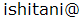
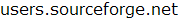

## About Licence
**CueMol** is distributed with **NO WARRANTY**.
Please use it **'at your own risk**'.
CueMol source code and distribution include the following codes and libraries:

*  [Mozilla XULRunner](../../en/https://developer.mozilla.org/ja/docs/XULRunner)
*  [FFTW](http://www.fftw.org)
*  [POV-Ray](http://www.povray.org)
*  SSM superpose
*  [BALL](http://www.ball-project.org/)
*  [pcre](http://www.pcre.org)
*  [expat](http://expat.sourceforge.net/)
*  zlib
*  libpng

CueMol is developed by the following contributors:

*  Ryuichiro Ishitani, 
*  Takanori Nakane (PyMOL session file importer)

For non-profit (academic) organization users,
CueMol (including both binary and source code) is distributed with no costs,
under the [GPLv3](http://opensource.org/licenses/GPL-3.0) .

If you are commercial organization user and want to use CueMol,
please contact

## Donation

You are welcome to donate for the CueMol project.
Your PayPal account is required for the donation.
See [the sourceforge's donation page](../../donate/group_id=103302) for details.