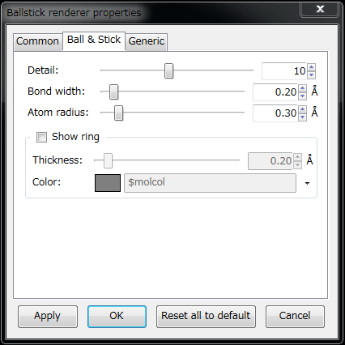
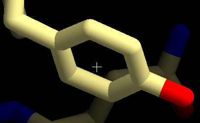
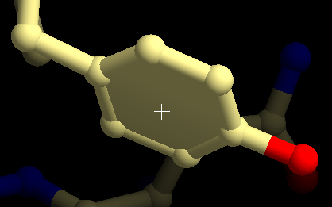
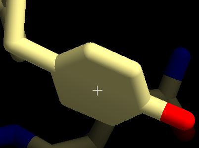
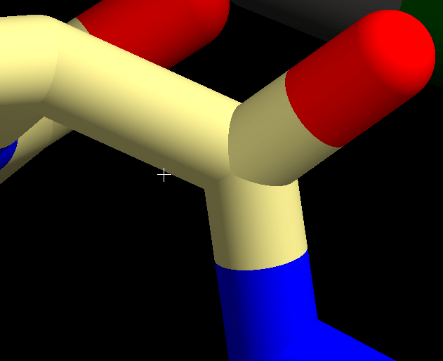
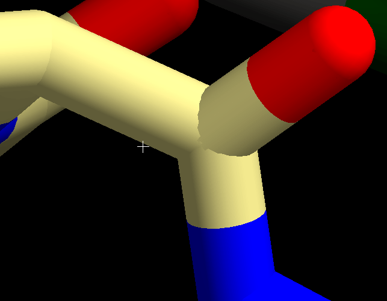

[Documents](../../../en/Documents)
## Ball and stick renderer
Ballstick renderer (representation) displays "ball-and-stick" (or "stick") representation of the molecules.

Ballstick renderer has the following display options (properties) including common and specific options.

As for the common settings, see [cuemol2/CommonRendererProps](../../../en/cuemol2/CommonRendererProps).

### Ballstick renderer settings

{ style="zoom: 0.5" .on-glb }

#### Detail
Triangulation level of the spheres and cylinders of the ball-and-stick models. Large value of detail results in smooth drawings, but slow down the rendering speed. The default setting (10) produces usually enough quality.

In the following cases, the detail value will be ignored (because they directly render spheres and cylinders, and do not divide them into triangles):

*  POV-Ray rendering (without edge and silhouette lines)
*  GL shader rendering mode (see below and [cuemol2/UseGLShader](../../../en/cuemol2/UseGLShader))

#### Bond width
Specify the size of the bond (more precisely, the radii of the cylinders connecting the atoms) in angstrom unit.

#### Atom radius
Specify the radii of the atom spheres in angstrom unit. The same size of bond width and atom radius result in "stick-like" representation.

{ style="zoom: 0.5" .on-glb }

#### Show ring
If this option is turned on, plates are displayed in the rings (i.e., benzene group of phenylalanine or ribose group of adenosine).

{ style="zoom: 0.5" .on-glb }

#### Thickness (of the rings)
Specify the thickness of the ring plates. The same size of thickness, bond width, and atom radius result in the representation as follows:

{ style="zoom: 0.5" .on-glb }

#### Color (of the rings)
Specify the color of the ring plates.
In the default setting ($molcol), the same color as the carbon in the ring member atoms is used.

### Ring topology specification
Rings of the ring-plate mode (see above) are not calculated from the molecular topology, but defined in the residue topology files.
So, the ring plates of the non-standard residues (e.g., drugs or ligands) will not be displayed correctly.
If you want to display ring plates for such non-standard residues, you have to write the topology file with ring definition for them.

### GL shader rendering of ball-stick model
If your graphics card has a capability of OpenGL shaders,
smooth spheres and cylinders of the ballstick renderers can be displayed without triangulation.

The left figure is displayed using shaders, while the right figure is displayed by conventional triangulation (with detail=10).

> { style="zoom: 0.33" .on-glb } { style="zoom: 0.33" .on-glb }

To use this function, please turn on the GL shader in the option dialog (see [cuemol2/UseGLShader](../../../en/cuemol2/UseGLShader)).
If GL shader rendering is turned on, the "detail" value of the ballstick renderer settings is ignored as described above.