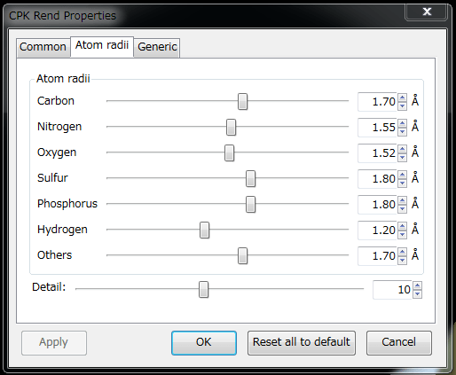
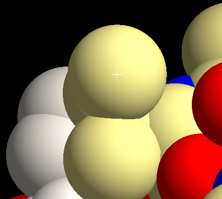
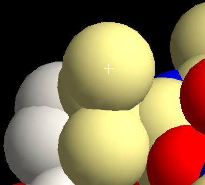

[Documents](../../../en/Documents)
## CPK renderer
CPK renderer (representation) displays so-called "Space-filling" models of the molecules.

CPK renderer has the following display options (properties) including common and specific options.

As for the common settings, see [cuemol2/CommonRendererProps](../../../en/cuemol2/CommonRendererProps).

### CPK renderer settings

{ style="zoom: 0.5" .on-glb }

#### Atomic radii
You can specify the radii of spheres of the space-filling representation.
The radii of spheres are determined by the element types: C, N, O, P, S, H and X (=other elements).

#### Detail
Triangulation level of the spheres. Large value of detail results in smooth spheres, but slow down the rendering speed.

In the following cases, the detail value will be ignored (because they directly render spheres and do not divide spheres into triangles):

-  POV-Ray rendering (without edge and silhouette lines)

-  GL shader rendering mode (see below and [cuemol2/UseGLShader](../../../en/cuemol2/UseGLShader))

### GL shader rendering of cpk models
If your graphics card has a capability of OpenGL shaders,
smooth spheres can be displayed without triangulation.

The left figure is displayed using shaders, while the right figure is displayed by conventional triangulation.

> { style="zoom: 0.5" .on-glb } { style="zoom: 0.5" .on-glb }

To use this function, please turn on the GL shader in the option dialog (see [cuemol2/UseGLShader](../../../en/cuemol2/UseGLShader)).
If GL shader rendering is turned on, the "detail" value of the cpk renderer settings is ignored as described above.
