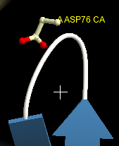
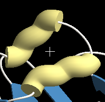
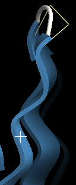
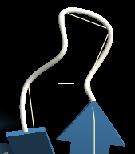

[Documents](../../../en/Documents)

#googletrnsl

## Cartoon renderer
Cartoon renderer is a representation for protein molecules,
which shows the secondary structural elements of proteins as follows:
*  Helices (alpha, 3-10, etc) as cylinders (or ribbons)
*  Beta sheets as plates
*  Coils as tubes

While the representation by the cartoon renderer is similar to that by the [ribbon renderer](../../../en/cuemol2/RibbonRenderer),
its helices, sheets, and coils are much more smooth than those of the ribbon renderer,
capturing the features of the secondary structural elements in the protein fold.

The following images show the examples of the cartoon with cylinder helix (left), cartoon with ribbon helix (middle), and ribbon (right) renderers with default parameters.

> { .on-glb }  { .on-glb } { .on-glb }

## Cartoon settings (Cartoon tab)
In this tab, you can specify the cartoon settings common to the helix, sheet, and coil.

{ style="zoom: 0.5" .on-glb }

Some settings are the same as those in the [common settings in the ribbon renderer](../../../en/cuemol2/RibbonRenderer).

### Spline anchor

> { .on-glb } &#8658; { .on-glb }

## Helix settings (Helix tab)

{ style="zoom: 0.5" .on-glb }

### Type of helix representation (helix_ribbon)
In the cartoon renderer, helices can be displayed as
*  Cylinders
*  Ribbons

At the top-level "Type:" option, you can choose cylinder or ribbon for the helix representation.

### Cylinder-helix settings
#### Spline smooth (helix_smooth)
This setting specifies the smoothness (or straightness) of the cylinders.
The value affects the shape of the cylinders as follows:
*  Small value results in kinked helices, gradually approaching a tube-like shape passing through the C-alpha positions.
*  Large value results in straight cylinders passing through the center of the helices.

The default value is 3.0, which results in the almost the straight (but slightly curved) cylinder representations.
The images below shows the same helices with the helix_smooth value of 1.0 (left), 2.0 (middle), and 4.0 (right), respectively.

> { .on-glb } { .on-glb } { .on-glb }

Although you can specify the negative or fractional values,
values in 2.0 - 4.0 may produce reasonable representations.

### Ribbon-helix settings
As in the "Helix" tab in the [ribbon renderer](../../../en/cuemol2/RibbonRenderer),
you can specify the shapes of the ribbon section and the head and tail.
#### Ribbon-helix section

#### Ribbon-helix Head/Tail

## Sheet settings (Sheet tab)
### Spline smooth (sheet_smooth)
The images below shows the same beta sheets with the sheet_smooth value of -5.0 (left), 0.0 (middle), and 3.0 (right), respectively. The values less than -2.0 result in the sheet nearly passing through the C-alpha positions, while those larger than 3.0 result in the nearly-straight sheets.

> { .on-glb } { style="zoom: 0.97" .on-glb } { style="zoom: 0.9" .on-glb }

## Coil settings (Coil tab)
### Spline smooth (coil_smooth)
The images below shows the same loops with the coil_smooth value of -5.0, -2.0, -1.0, and 0.0, (from left to right) respectively.
The values less than -2.0 result in the sheet nearly passing through the C-alpha positions, while those larger than 0.0 apart from the actual C-alpha position, and thus result in too-much simplified loop representation.

> { .on-glb } { .on-glb } { .on-glb } { .on-glb }