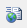
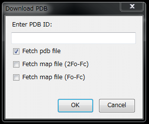
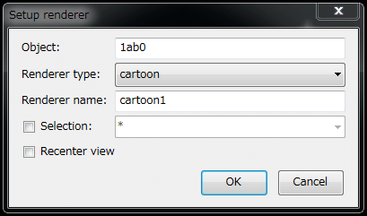
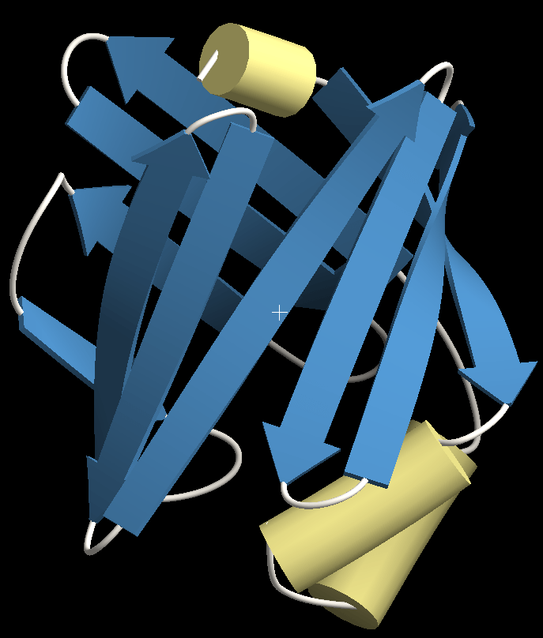
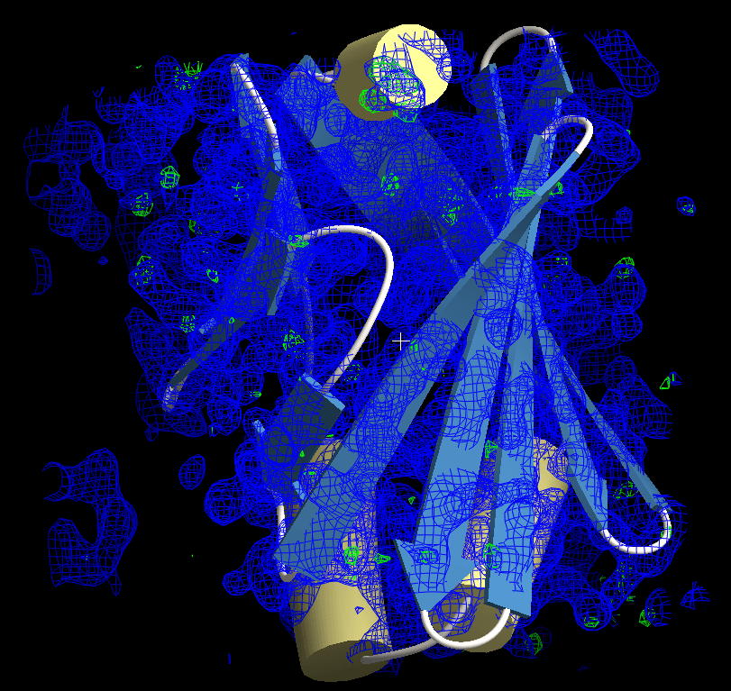

[Documents](../../../en/Documents)
## Fetch PDB and other files from net
You can download and display PDB files and electron density map files from the internet.

By executing the menu "File" --> "GET PDB using accession code..." or the toolbar menu ,
you will see the "Download PDB" dialog:

{ style="zoom: 0.5" .on-glb }

### Fetch PDB files from net
Please enter the PDB ID in the text box, confirm that only the "Fetch pdb file" item is checked (as in the above image), and then press the OK button.

If the entered PDB ID is valid, you will see the setup-renderer dialog like this.

{ style="zoom: 0.5" .on-glb }

This dialog is the same as that appeared when [open the PDB files](../../../en/cuemol2/OpenFiles).
Please select the renderer type (and optionally renderer name, selection).
It is better to select the "Recenter view" option.

After pressing the OK button (the download time is depends on the size of the molecule), you will see the molecule you want show in the molecule view.

{ style="zoom: 0.33" .on-glb }

### Fetch density map files from net
If you also want to see the density map(s) of the PDB file,
please select the "Fetch map file (2Fo-Fc)" or "Fetch map file (Fo-Fc)" items
in the Download-PDB dialog. 
(Of course, you can download both PDB and all map files at once, or only the map files if you already have the PDB coordinates file.)

After pressing the OK button, the electron density maps will appear in the molecule view.
In default settings, the 2Fo-Fc map appears in blue color contoured at 1.1 sigma, while the Fo-Fc maps in green color contoured at 3.0 sigma (as similar to the default of Coot).

{ style="zoom: 0.33" .on-glb }

### Download sources
The Fetch PDB dialog/tool of the CueMol2 fetch these files from the following servers:
*  http://www.rcsb.org/pdb/
*  http://eds.bmc.uu.se/eds/