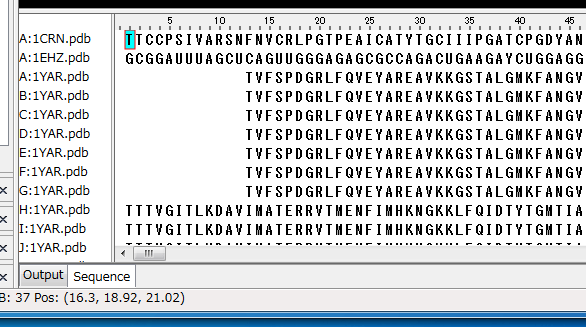
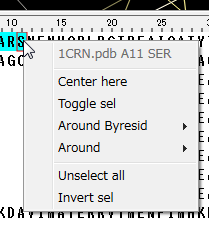

[Documents](../../../en/Documents)
## Sequence display panel
In the sequence display panel, which is located at the bottom of the CueMol2 window, you can browse the amino- and nucleic acid-sequences of the molecules loaded in the active scene.

{ style="zoom: 0.5" .on-glb }

In the sequence view:

*  Amino acids are shown with single-letter notation.
*  Nucleic acids (DNA and RNA) are shown with single-letter notation.
*  Other non-standard residues, ligands, and ions, etc. are shown with asterisk mark (*).
*  Selected residues are highlighted with cyan background.
*  Dragging region is indicated by dark-green rectangle.
*  Pivot residue is indicated by red rectangle.

### Mouse operations in the sequence panel
Following mouse operations are possible in the sequence display panel:
Left click
:   Toggle the selection of the clicked residue in the corresponding molecule. The center of the Molecule view is also move to the corresponding residue. The pivot residue is also updated to the clicked position.

Left click+Shift key
:   Toggle the selection of the residues from the pivot to the clicked residues.

Right click
:   Display the context menu (see below) of the clicked residue in the corresponding molecule.

Drag (with left button)
:   Select (or unselect) the dragged region of the molecule. If the start point of the mouse drag is already selected, the dragged region will be unselected.

#### Context menu
The context menu shown in the below is displayed by the right-click of the sequence.

{ .on-glb }

Molecule name and residue info
:   Molecule name and residue information are shown at the top of the menu.

Center here
:   Move the center of the Molecule view to the position of the corresponding residue.

Toggle sel
:   Toggle the selection of the corresponding residue.

Around Byresid
:   Select the "residues" in the specified distance from the current selected region(s).

Around
:   Select the "atoms" in the specified distance from the current selected region(s).

Unselect all
:   Unselect all atoms in the corresponding molecule (without affecting other molecules).

Invert sel
:   Invert selections in the corresponding molecule (without affecting other molecules).
