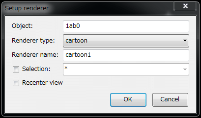

## ネットからPDBやその他のファイルを取得
インターネットからPDBファイルや電子密度マップファイルをダウンロードして表示できます。

メニュー「File」-->「GET PDB using accession code...」またはツールバーメニュー

を実行すると、「Download PDB」ダイアログが表示されます：

{ style="zoom: 0.5" .on-glb }

### ネットからPDBファイルを取得
テキストボックスにPDB IDを入力し、「Fetch pdb file」項目のみがチェックされていることを確認して（上の画像のように）、OKボタンを押してください。

入力されたPDB IDが有効な場合、以下のようなセットアップレンダラーダイアログが表示されます。

{ style="zoom: 0.5" .on-glb }

このダイアログは[PDBファイルを開く](../../../OpenFiles)ときに表示されるものと同じです。
レンダラータイプ（および必要に応じてレンダラー名、選択範囲）を選択してください。
「Recenter view」オプションを選択することをお勧めします。

OKボタンを押すと（ダウンロード時間は分子のサイズに依存します）、目的の分子が分子ビューに表示されます。

{ style="zoom: 0.33" .on-glb }

### ネットから密度マップファイルを取得
PDBファイルの密度マップも見たい場合は、
Download-PDBダイアログで「Fetch map file (2Fo-Fc)」または「Fetch map file (Fo-Fc)」項目を選択してください。 
（もちろん、PDBとすべてのマップファイルを一度にダウンロードすることも、PDB座標ファイルを既に持っている場合はマップファイルのみをダウンロードすることも可能です。）

OKボタンを押すと、電子密度マップが分子ビューに表示されます。
デフォルト設定では、2Fo-Fcマップは1.1シグマで等高線表示された青色で表示され、Fo-Fcマップは3.0シグマで等高線表示された緑色で表示されます（Cootのデフォルトと同様）。

{ style="zoom: 0.33" .on-glb }

### ダウンロード元
CueMol2のFetch PDBダイアログ/ツールは、以下のサーバーからこれらのファイルを取得します：

*  http://www.rcsb.org/pdb/
*  http://www.ebi.ac.uk/

